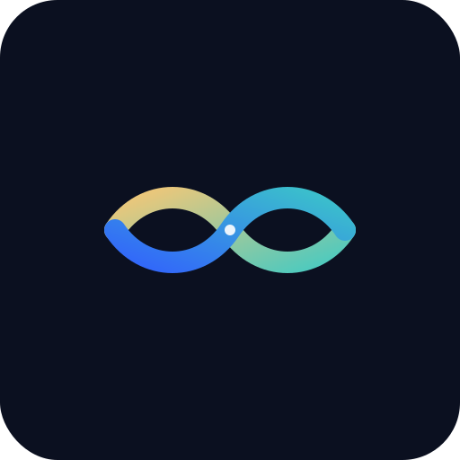

   
   

   

  <strong>🌍 Reflexhon Global 2027</strong> 
  <em>Human-Centered Intelligence Ecosystem</em>

  
  
  
  
  

---

# 🌍 Reflexhon Global 2027  
<!-Reflexhon Global – Status Badges -->

  
  
  
  
  

  

> **Human-Centered Intelligence Ecosystem**  
> AI ku ta amplifiká humanidad, kreatividat i empatia — no pa suplantá.  

---

## 🎯 **Visión**
Reflexhon Global ta un SaaS i movemento ku ta uni **AI étiko**, **ekonomia nobo**, i **kultura lokal**.  
Ta un AI ku siña pa reflehá:  
💫 *rasonamentu*,  
🎨 *kreatividat*,  
🤝 *humanidad.*

---

## 🧩 **Komponentenan di e Ekosistema**
| Layer | Deskripshon | Impacto |
|-------|--------------|---------|
| 🧠 **Reflexhon Core** | AI ku Reasoning, Creative, i Empathic layers | Siñansa étiko i kolaborativo |
| 💠 **ReflexCoin Economy** | Token étiko pa kontribushon real | Kreashon di valor humano |
| 🎨 **ReflexMarket** | Marketplace pa assets i prompts | Income justo pa kreatornan |
| 💎 **Treasury DAO** | Gobernashon komunitario | Finansia edukashon i AI étiko |

---

## 🪞 **Círculo di Valor**
`Creators → AI Core → Marketplace → Treasury → ReflexCoin → Creators`

↪️ Kada paso ta generá:
- 💰 *Valor ekonomiko* — ingreso sostenible  
- 🧩 *Valor edukativo* — transferensia di skill  
- 💫 *Valor humano* — konektividat i alegria  

---

## ⚙️ **Teknologia & Arkitektura**
📘 [Local Setup Guide](./setup_reflexhon_local.md)

- **Frontend:** Next.js + Tailwind + WebAssembly  
- **Backend:** Node/Nest + Prisma + Redis Mesh  
- **AI Mesh:** RL policies ku konteksto kultural  
- **Storage:** IPFS + Cloudflare R2  
- **Ethic Guard:** Bias audit i privasidat monitor  

---

## 🗺️ **Roadmap**
**2024–2025:** Reflexhon Studio MVP + ReflexCoin Pilot  
**2026:** ReflexMarket + Treasury DAO  
**2027:** Reflexhon Mesh AI Global + Reflexhon Economy full  

---

## 🌱 **Impacto Sosial**
- Edukashon libre den idioma lokal  
- AI pa preservashon di kultura  
- Green AI infra ku kompensashon ambiental  

---

## 🌐 **Links Útil**
🔗 [**Reflexhon Deck (HTML)**](https://sahidattaf.github.io/reflexhon-global/reflexhon_deck.html)  
📘 [**Reflexhon Workspace (Markdown)**](./reflexhon_workspace.md)  
🪞 [**Reflexhon Embed Deck (pa Notion)**](https://sahidattaf.github.io/reflexhon-global/reflexhon_embed.html)  
🔗 [View Reflexhon Deck](https://sahidattaf.github.io/reflexhon-global/reflexhon_deck.html)
📘 [🤝 Komunidad & Kontribushon](COMMUNITY.md)

📘 [Local Setup Guide](./setup_reflexhon_local.md)

---

📘 [Community Guide](./COMMUNITY.md) – Guia pa kontribuidó, kreator, edukador

🧠 [Contributing](./CONTRIBUTING.md) – Komo hasi commit ku refleho

📜 [Code of Conduct](./CODE_OF_CONDUCT.md) – Nos base di respeto i komportashon étiko

📘 [Slack Guide](./reflexhon_slack_guide.md) – Komunikashon étiko i kanal di koordinashon.

---

## 🤝 **Komunidad & Kolaborashon**
Reflexhon ta abierto pa kreator, edukador, developer, i investigadó ku ke kontribuí na un AI ku valor humano.  
💬 Join e movemento via Reflexhon DAO (koming soon).  

---

## 📜 **License**
MIT License © 2025 [@sahidattaf](https://github.com/sahidattaf)  

> *“Un AI ku siña pa reflehá humanidad, ta un AI ku ta kreá futuro.”*  
> — Reflexhon Global Manifesto 🌞
> ---

📘 [Reflexhon Wiki](https://github.com/sahidattaf/reflexhon-global/wiki) – Manual modular pa AI, DAO, Roadmap

🧠 [Contributing Guide](./CONTRIBUTING.md) – Komo kontribuí ku refleho

🤝 [Community Guide](./COMMUNITY.md) – Ròl, kontaktu, DAO

📜 [Code of Conduct](./CODE_OF_CONDUCT.md) – Komportashon étiko

🔐 [Security Policy](./SECURITY.md) – Pa report vulnerabilidat (opcional)

🪙 [Funding Reflexhon](./.github/FUNDING.yml) – DAO Wallet / GitHub Sponsors (si bo ke implementá)

---

